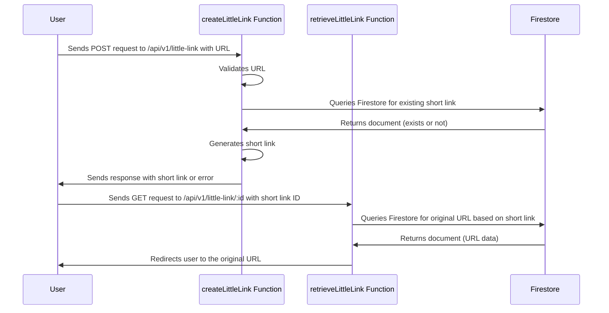

# Little Links cloud functions

A simplified url shortening service taking advantage of cloud run functions for an extremely light weight implementation. Both functions are included in the same file to help with cognitive understanding and to share some of the lazy bootstrapping process but could easily be split if/when they grow.

Another 'full service' example using NestJS is provided and is where more time is spent on concepts such as testing and architecture, but given the simple requirements this would be my first 'real' implementation

## Request/Response diagram


## Setup

Run `npm install` and follow the below cloud CLI requirements.

## Set up Google Cloud CLI

This project takes full advantage of [Google Application Default Credentials](https://cloud.google.com/docs/authentication/provide-credentials-adc) for an extremely simple setup and is required to run it both locally and within Google Cloud Run. This means it will work within the project context when deployed to cloud run and also allow easy switching/authentication of google services when running locally.

In order to use this effectively it is important to set up Google Cloud CLI by running `gcloud init` and selecting the correct account/project

## Service requirements

The project being used must have enabled Firestore and have created at least one database. The `(default)` database is used by default but can be changed by using the ENV variable `FIRESTORE_DATABASE` from any source including a .env file.

In order to confirm a database is created you can run `gcloud firestore databases list` after setting up the Google Cloud CLI. If there are no databases you can create the default database with `gcloud firestore databases create --location=eur3` or add a name via `gcloud firestore databases create --location=eur3 --database=<NAME>`

It's also required to have functions enabled, although you will be prompted to enable them if they are not already.

In order to ensure the service works correctly it is <strong>required</strong> that both functions are deployed to the same region and the same project. This is achieved easily by setting the function region with the following command (europe-west is the example here)
`gcloud config set functions/region europe-west1` 

## Interacting with the service

After deploying the service to the cloud you will see two URL's provided, one for each function. In order to interact with the API any client can be used, but a curl example is given below (make sure to update the <CREATE_URL>!)

```bash
$ curl --request POST \
  --url <CREATE_URL> \
  --header 'Content-Type: application/json' \
  --data '{
	"url": "https://google.com"
  }'
```

This will return

```json
{ "shortLink": "<SHORT_URL>" }
```

You can then open this link in a browser to be automatically redirected or use curl with/without redirects

```bash
# without following redirect
curl <SHORT_URL>

# response
Found. Redirecting to https://google.com%

# following redirect
curl -L <SHORT_URL>

# response is HTML for googles main page
```

## Linting

Linting is availabile with `npm run lint`

## Linting

Testing is ran via jest with `npm run test`

