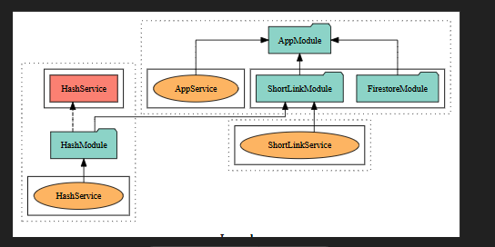
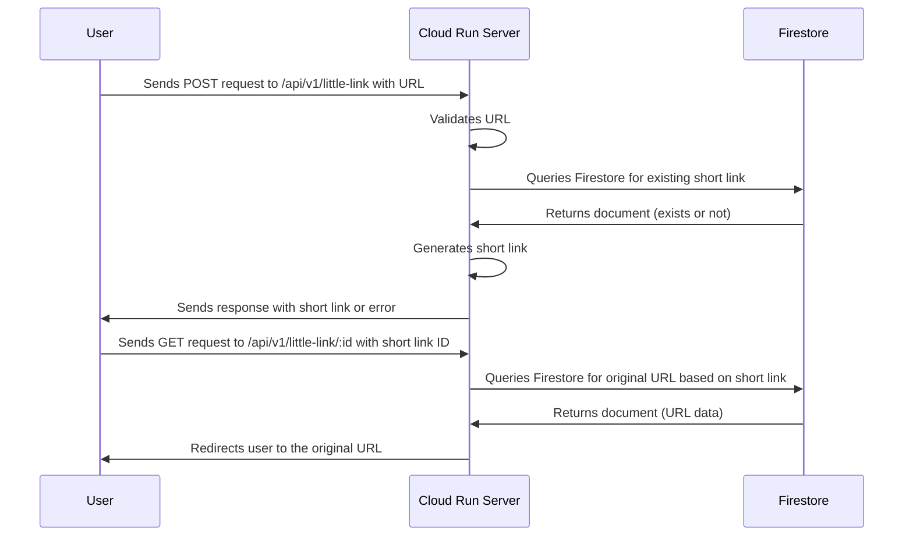

<p align="center">
  <a href="http://nestjs.com/" target="blank"></a>
</p>


  <p align="center">A progressive <a href="http://nodejs.org" target="_blank">Node.js</a> framework for building efficient and scalable server-side applications.</p>
  
  <!--[](https://opencollective.com/nest#backer)
  [](https://opencollective.com/nest#sponsor)-->

## Description

Little links is a URL shortener made for the Book Creator technical test. This version is made using the [Nest](https://github.com/nestjs/nest) framework as it is the one most familiar to myself and should be a reasonable showcase for a simple applications.



Whilst there is plenty going on with Nest this overview  should give a rough idea of the architecture of this application. The [documentation command](#documentation) listed below includes this and much more. FirestoreModule is registered globally and available in any suitable editor including [live editor](https://mermaid.live/)

## Request/Response Flow
This will automatically render in Github but you may use any editor such


## Features
Little links is a very simple API that supports url shortening with two simple end points POST `/api/v1/short-link` and GET `api/v1/short-link/:shortLinkId` using firebase. It's designed as a simple public interface where multiple requests to shorten the same URL result in the same short URL. Another large liberity is using the same GDC for running the app and e2e testing meaning that data is written into the same DB locally. Given the nature of the application it is not problematic but would be something to address if further features were added.

There is no caching implemented given the cloud run nature of the project, as this would be easily achieved using [NestJS Caching](https://docs.nestjs.com/techniques/caching#using-alternative-cache-stores) with a google memory store instance (i.e Redis), however given the fact this is a toy project it is omitted. It's my view to keep things simple and evolve as needed.

In this vein, there is an additional simpler project supplied which is how i would initially implement this if it was real life (simply using some Google cloud run functions) however that felt 'cheap' to the point it would not give you adequete code to judge me as a candidate.

### Documentation
There is additional, auto-generated documentation that will allow you to get familiar with the code quickly available by running `npm run docs` and clicking the link available in the console

## Project setup

```bash
$ npm install
```

There are some configuration options available in the .env file and an example is given, however these are optional and not required to run the application.

## Set up Google Cloud CLI
This project takes full advantage of [Google Application Default Credentials](https://cloud.google.com/docs/authentication/provide-credentials-adc) for an extremely simple setup and is required to run it both locally and within Google Cloud Run. This means it will work within the project context when deployed to cloud run and also allow easy switching/authentication of google services when running locally.

In order to use this effectively it is important to set up Google Cloud CLI by running `gcloud init` and selecting the correct account/project

If you have already set up Cloud CLI instead make sure the correct account and project are set.

## Service requirements
The project being used must have enabled Firestore and have created at least one database. The `(default)` database is used by default but can be changed by using the ENV variable `FIRESTORE_DATABASE` from any source including a .env file.

In order to confirm a database is created you can run `gcloud firestore databases list` after setting up the Google Cloud CLI. If there are no databases you can create the default database with `gcloud firestore databases create --location=eur3` or add a name via `gcloud firestore databases create --location=eur3 --database=<NAME>`


## Compile and run the project locally

```bash
# development
$ npm run start
# watch mode
$ npm run start:dev

# production mode
$ npm run start:prod

# build
$ npm run build
```

Once the project is being served Swagger is configured and is an easy way to test and use the API locally, accessible through http://localhost:3000/api by default although any client such as postman can be used.

## Run tests

```bash
# unit tests
$ npm run test
# unit tests with auto watch
$ npm run test:watch
# test coverage
$ npm run test:cov

# e2e tests
$ npm run test:e2e
# e2e tests with auto watch
$ npm run test:e2e:watch

```

# Deploying to Google Cloud Run

Run the command `gcloud run deploy --source=. --allow-unauthenticated --region=europe-west1 little-link`. There are lots of additional options available [here](https://cloud.google.com/sdk/gcloud/reference/run/deploy)

This will build and deploy the application into europe west and should look like below. The `Service URL` can then be clicked to access the API and appended with `/api` to reach the swagger documentation.

```bash
Deploying from source requires an Artifact Registry Docker repository to store built containers. A repository named [cloud-run-source-deploy] in region [europe-west1] will be created.

Do you want to continue (Y/n)?  y

Building using Dockerfile and deploying container to Cloud Run service [little-link] in project [littlelink-448310] region [europe-west1]
✓ Building and deploying new service... Done.                                                                                                                                                                                                                                                                                                                                                                                     
  ✓ Creating Container Repository...                                                                                                                                                                                                                                                                                                                                                                                              
  ✓ Uploading sources...                                                                                                                                                                                                                                                                                                                                                                                                          
  ✓ Building Container... Logs are available at [https://console.cloud.google.com/cloud-build/builds/96178f50-5e42-4296-a0dd-bde337ce4258?project=629279656240].                                                                                                                                                                                                                                                                  
  ✓ Creating Revision...                                                                                                                                                                                                                                                                                                                                                                                                          
  ✓ Routing traffic...                                                                                                                                                                                                                                                                                                                                                                                                            
  ✓ Setting IAM Policy...                                                                                                                                                                                                                         
Done.                                                                                                                                                                                                                                                                                                                                                                                                                            
Service [little-link] revision [little-link-00001-p69] has been deployed and is serving 100 percent of traffic.
Service URL: https://little-link-629279656240.europe-west1.run.app
```
